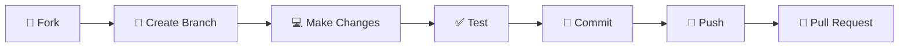

<div align="center">

# 🚀 Full-Stack Web Application


<p align="center">
  
  
  
  
  
</p>

<p align="center">
  <a href="#-features">Features</a> •
  <a href="#-tech-stack">Tech Stack</a> •
  <a href="#-getting-started">Getting Started</a> •
  <a href="#-api-documentation">API Docs</a> •
  <a href="#-contributing">Contributing</a>
</p>

---

</div>

## 📋 Table of Contents

- [✨ Features](#-features)
- [🛠️ Tech Stack](#️-tech-stack)
- [📁 Project Structure](#-project-structure)
- [🚀 Getting Started](#-getting-started)
- [📚 API Documentation](#-api-documentation)
- [🎨 Frontend Details](#-frontend-details)
- [⚙️ Backend Details](#️-backend-details)
- [🔐 Authentication](#-authentication)
- [🤝 Contributing](#-contributing)
- [📄 License](#-license)

---

## ✨ Features

<div align="center">

| Feature | Description |
|---------|-------------|
| 🔐 | **Secure Authentication** - JWT-based auth with bcrypt password hashing |
| 🎨 | **Modern UI** - Built with React 19 and modern CSS |
| ⚡ | **Fast Performance** - Powered by Vite for lightning-fast builds |
| 🔄 | **State Management** - Redux Toolkit for predictable state updates |
| 🛣️ | **Routing** - React Router DOM v7 for seamless navigation |
| 💾 | **Database** - MySQL with Sequelize ORM for data persistence |
| 🔌 | **RESTful API** - Clean and well-structured API endpoints |
| 🚀 | **Production Ready** - Optimized for deployment |

</div>

---

## 🛠️ Tech Stack

<div align="center">

### Frontend 🎨

<p>
  
</p>

| Technology | Version | Purpose |
|------------|---------|---------|
| React | 19.2.0 | UI Library |
| Redux Toolkit | 2.10.1 | State Management |
| React Router | 7.9.6 | Navigation |
| Vite | 7.2.4 | Build Tool |

### Backend ⚙️

<p>
  
</p>

| Technology | Version | Purpose |
|------------|---------|---------|
| Express | 5.1.0 | Web Framework |
| MySQL | 3.15.3 | Database |
| Sequelize | 6.37.7 | ORM |
| JWT | 9.0.2 | Authentication |
| Bcrypt | 3.0.3 | Password Hashing |

</div>

---

## 📁 Project Structure

```
📦 simple-fullstack
┣ 📂 backend
┃ ┣ 📂 src
┃ ┃ ┣ 📂 controllers
┃ ┃ ┣ 📂 models
┃ ┃ ┣ 📂 routes
┃ ┃ ┣ 📂 middleware
┃ ┃ ┣ 📂 config
┃ ┃ ┗ 📜 server.js
┃ ┣ 📜 package.json
┃ ┗ 📜 .env
┣ 📂 frontend
┃ ┣ 📂 src
┃ ┃ ┣ 📂 components
┃ ┃ ┣ 📂 pages
┃ ┃ ┣ 📂 redux
┃ ┃ ┣ 📂 utils
┃ ┃ ┣ 📜 App.jsx
┃ ┃ ┗ 📜 main.jsx
┃ ┣ 📜 package.json
┃ ┣ 📜 index.html
┃ ┗ 📜 vite.config.js
┗ 📜 README.md
```

---

## 🚀 Getting Started

<div align="center">

</div>

### Prerequisites

Before you begin, ensure you have the following installed:

-  (v18 or higher)
-  (v8.0 or higher)
-  or 

### Installation Steps

#### 1️⃣ Clone the Repository

```bash
git clone https://github.com/yourusername/simple-fullstack.git
cd simple-fullstack
```

#### 2️⃣ Setup Backend

```bash
cd backend
npm install

# Create .env file
touch .env
```

Add the following to your `.env` file:

```env
PORT=5000
DB_HOST=localhost
DB_USER=root
DB_PASSWORD=yourpassword
DB_NAME=fullstack_db
JWT_SECRET=your_super_secret_jwt_key_here
NODE_ENV=development
```

**Create Database:**

```bash
# Login to MySQL
mysql -u root -p

# Create database
CREATE DATABASE fullstack_db;
exit;
```

**Run Migrations:**

```bash
npx sequelize-cli db:migrate
```

**Start Backend Server:**

```bash
npm run dev
```

> 🟢 Backend running on http://localhost:5000

#### 3️⃣ Setup Frontend

Open a new terminal:

```bash
cd frontend
npm install

# Start development server
npm run dev
```

> 🟢 Frontend running on http://localhost:5173

---

## 📚 API Documentation

<div align="center">

### 🔗 Base URL

```
http://localhost:5000/api
```

</div>

### Authentication Endpoints

| Method | Endpoint | Description | Auth Required |
|--------|----------|-------------|---------------|
| 🟢 POST | `/auth/register` | Register new user | ❌ |
| 🟢 POST | `/auth/login` | Login user | ❌ |
| 🔵 GET | `/auth/profile` | Get user profile | ✅ |
| 🟡 PUT | `/auth/profile` | Update profile | ✅ |

#### Register User

**Request:**

```json
POST /api/auth/register
Content-Type: application/json

{
  "username": "johndoe",
  "email": "john@example.com",
  "password": "securepassword123"
}
```

**Response:**

```json
{
  "success": true,
  "message": "User registered successfully",
  "token": "eyJhbGciOiJIUzI1NiIsInR5cCI6IkpXVCJ9...",
  "user": {
    "id": 1,
    "username": "johndoe",
    "email": "john@example.com"
  }
}
```

#### Login

**Request:**

```json
POST /api/auth/login
Content-Type: application/json

{
  "email": "john@example.com",
  "password": "securepassword123"
}
```

**Response:**

```json
{
  "success": true,
  "message": "Login successful",
  "token": "eyJhbGciOiJIUzI1NiIsInR5cCI6IkpXVCJ9...",
  "user": {
    "id": 1,
    "username": "johndoe",
    "email": "john@example.com"
  }
}
```

---

## 🎨 Frontend Details

### Key Features

- **Component-based Architecture**: Reusable and maintainable components
- **Redux State Management**: Centralized state with Redux Toolkit
- **React Router**: Client-side routing with protected routes
- **Responsive Design**: Mobile-first responsive layouts
- **Modern ES6+ Syntax**: Clean and readable code

### Redux Store Structure

```javascript
store
├── auth
│   ├── user
│   ├── token
│   └── isAuthenticated
├── ui
│   ├── loading
│   └── theme
└── data
    └── items
```

### Available Scripts

```bash
npm run dev      # Start development server
npm run build    # Build for production
npm run preview  # Preview production build
npm run lint     # Run ESLint
```

---

## ⚙️ Backend Details

### Architecture

```
┌─────────────┐      ┌─────────────┐      ┌─────────────┐
│   Client    │─────▶│   Routes    │─────▶│ Controllers │
└─────────────┘      └─────────────┘      └─────────────┘
                             │                     │
                             ▼                     ▼
                     ┌─────────────┐      ┌─────────────┐
                     │ Middleware  │      │   Models    │
                     └─────────────┘      └─────────────┘
                             │                     │
                             ▼                     ▼
                     ┌─────────────────────────────────┐
                     │          MySQL Database          │
                     └─────────────────────────────────┘
```

### Middleware Stack

1. **CORS**: Cross-origin resource sharing
2. **Body Parser**: JSON request parsing
3. **JWT Verification**: Token-based authentication
4. **Error Handling**: Centralized error management

### Available Scripts

```bash
npm start        # Start production server
npm run dev      # Start with nodemon (auto-reload)
npm test         # Run tests
```

---

## 🔐 Authentication

The application uses **JWT (JSON Web Tokens)** for secure authentication.

### Flow Diagram

```
┌──────────┐                    ┌──────────┐                    ┌──────────┐
│  Client  │                    │  Server  │                    │ Database │
└────┬─────┘                    └────┬─────┘                    └────┬─────┘
     │                               │                               │
     │  1. POST /auth/login          │                               │
     ├──────────────────────────────▶│                               │
     │                               │  2. Verify credentials        │
     │                               ├──────────────────────────────▶│
     │                               │                               │
     │                               │  3. User data                 │
     │                               │◀──────────────────────────────┤
     │  4. JWT Token + User data     │                               │
     │◀──────────────────────────────┤                               │
     │                               │                               │
     │  5. Subsequent requests       │                               │
     │     (with Authorization)      │                               │
     ├──────────────────────────────▶│                               │
     │                               │  6. Verify JWT                │
     │                               │                               │
     │  7. Protected resource        │                               │
     │◀──────────────────────────────┤                               │
     │                               │                               │
```

### Protected Routes

Add the authentication middleware to protect routes:

```javascript
// Backend
import { verifyToken } from './middleware/auth.js';

router.get('/protected', verifyToken, controller.getData);
```

```javascript
// Frontend - Protected Route Component
<Route 
  path="/dashboard" 
  element={
    <PrivateRoute>
      <Dashboard />
    </PrivateRoute>
  } 
/>
```

---

## 🤝 Contributing

Contributions are always welcome! Here's how you can help:

<div align="center">



</div>

### Steps to Contribute

1. **Fork the Project**
   ```bash
   # Click the 'Fork' button on GitHub
   ```

2. **Create your Feature Branch**
   ```bash
   git checkout -b feature/AmazingFeature
   ```

3. **Commit your Changes**
   ```bash
   git commit -m '✨ Add some AmazingFeature'
   ```

4. **Push to the Branch**
   ```bash
   git push origin feature/AmazingFeature
   ```

5. **Open a Pull Request**

---

## 🎯 Roadmap

- [x] User Authentication
- [x] JWT Integration
- [x] MySQL Database Setup
- [ ] User Profile Management
- [ ] File Upload System
- [ ] Email Notifications
- [ ] Social Media Integration
- [ ] Admin Dashboard
- [ ] Real-time Chat
- [ ] Docker Support
- [ ] CI/CD Pipeline

---

## 📄 License

<div align="center">

This project is licensed under the ISC License.

Made with ❤️ by [Your Name]


</div>

---

<div align="center">

### 📫 Connect With Me

[](https://github.com/yourusername)
[](https://linkedin.com/in/yourusername)
[](https://twitter.com/yourusername)
[](https://yourportfolio.com)

### ⭐ Star this repo if you found it helpful!


</div>